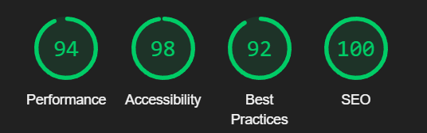

# eCommerce Tech Shop App

Developed a feature-rich e-commerce website with Next.js, Tailwind CSS, and Node.js.

- Live Demo: https://tech-shop-app.vercel.app/

## Features

- **Product Browsing**: Browse a wide range of products, including detailed descriptions and images.
- **Sorting**: Sort products by various criteria like price, popularity, and more.
- **Search Functionality**: Easily search for products by name or category.
- **Order History**: Keep track of past orders for reference.
- **User Authentication**: Secure user authentication for protected features and personalized experiences.

## Chrome Lighthouse Score

- These are the scores of the store page

## Technology Stack

- **Next.js**: Utilized for server-side rendering (SSR) to enhance performance and SEO optimization.
- **Tailwind CSS**: Provided responsive and beautiful styling with minimal effort.
- **Node.js**: Supported server-side logic and API endpoints.
- **Auth.js**: Integrated for secure user authentication and personalized experiences.

## Key Decisions

### Why Use Next.js?

Next.js was chosen to leverage its server-side rendering (SSR) capabilities, which significantly enhance the performance and SEO optimization of the e-commerce website. SSR ensures faster load times and improved search engine rankings, resulting in a better user experience.

### Why Use TypeScript?

TypeScript was used to bring strong typing to the project, reducing runtime errors and providing better code quality. It enhances code readability and maintainability while also offering excellent support for autocompletion and type checking during development.

### Why Use Tailwind CSS?

Tailwind CSS was chosen to expedite the styling process with pre-designed utility classes, ensuring consistency and responsiveness across the application. It simplifies the creation of a visually appealing user interface and reduces the need for custom CSS.

### Testing

For this project i didn't use any testing strategy, that said In the pursuit of enhancing the quality of this project, i plan to refactor some code, and add new features to the project, so i plan on adding unit tests and end to end testing to some parts that i plan to refactor.

- Next Steps

- Add an Admin panel, for products, users and orders management.

- Optimistic updates with react query

- Refactor code and add tests

- Improve the UI design
